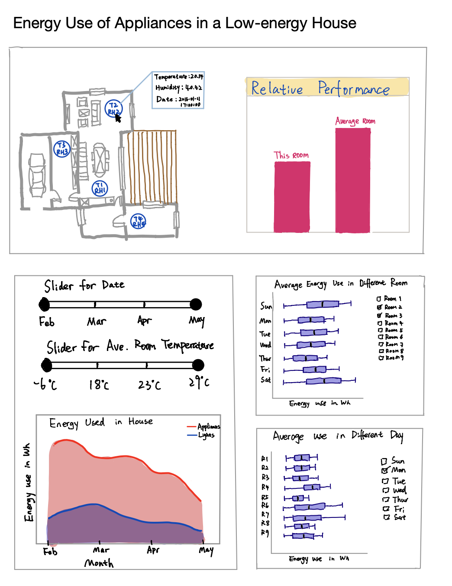

# {Short snappy Title of your project} (Group X)

- Your title can change over time.
- Here you should add the problem this dashboard hopes to solve

## Team Members

- Person 1: one sentence about you!
- Person 2: one sentence about you!
- Person 3: one sentence about you!
- Person 4: one sentence about you!

## Describe your topic/interest in about 150-200 words

{Add your stuff here}

## About this Dashboard

The dashboard offers an interactive floorplan where the user can select which room they would like to display data for. The plot next to the floorplan updates with temperature and humidity plots for the selected room. Expanded plots are displayed below showing outdoor temperature and humidity data alongside energy usage for the house. Using a selection of sliders, users can set the time range for the data.

Ideally, you'd include a 5-7 second gif of your final dashboard.

## Describe your dataset in about 150-200 words

Add information about your dashboard here

## Acknowledgements and references 

