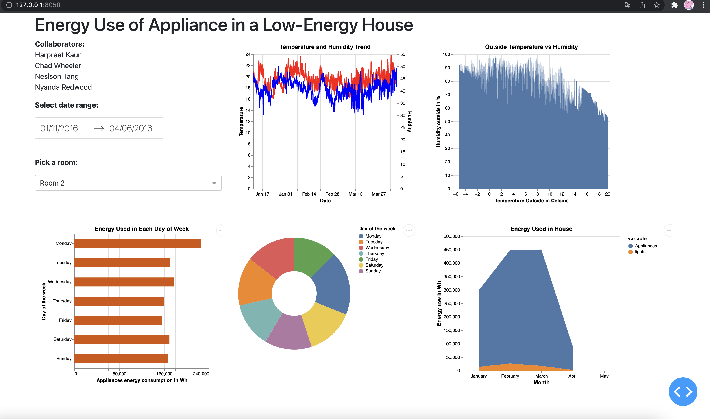

# Belgium's Energy Consumption Visualization (Group B)

### Deployed App Links

Chad Wheeler: [https://py-prototype.herokuapp.com/](https://py-prototype.herokuapp.com/)

Harpreet Kaur: [https://powerful-spire-82147.herokuapp.com/](https://powerful-spire-82147.herokuapp.com/)

Nelson Tang: [https://data551-milestone2.herokuapp.com/](https://data551-milestone2.herokuapp.com/)

Nyanda Redwood: [energy-app](https://energy-app.herokuapp.com/)

## Who are we

- Chad: "An intelligent and witty person that works on the betterment of oneself and those around him." -Jacob
- Harpreet: Passionate mathematician on the path of becoming a statistician.
- Nelson: Definitely a data engineer on my right track in the near future.
- Nyanda: Life long learner vested with a growth mentality.

## What are we doing and Why

It is really important for the electricity grid operators to determine the amount of electricity fed into the electricity grid otherwise it might lead to a power blackout. The served purpose for this visualization would be to help the energy management system of Belgium to determine the adequate size of photovoltaic and energy storage to diminish the power flow into the grid during the various seasons of the year. Moreover, since the data is collected from a low-energy house it would help the management to address the challenge and decide upon a minimum threshold per household for load control if required in any unforeseen emergency situation. For instance, in case the management is willing to perform certain changes in the services or is willing to keep the power grid under maintenance then they would require a backup system that has the capacity to handle the least amount of energy load per household which is dependent on that power grid which is under maintenance. Our main focus would be to help the team to find out only the necessary amount of energy required by a Belgium resident. Our app will allow the user/the operator's supervising team to flexibly filter their search and view different aspects of the data by filtering and re-ordering on different variables.

## How can you get involved

The dashboard offers an interactive layout where the user can select from the dropdown the room they would like to view a summarized analysis. The plot next to the selection would update the temperature v/s humidity plot for the selected room. Expanded plots would be displayed showing the other charts relating to the energy usage for the house. The dashboard would also provide you the flexibility to pick and choose the slected range of dates for which you had like to view the temperature and energy consumption differences. For instance, analyzing the variation for temperature and energy consumption for the winter season(selecting January month) to the spring time(selecting April month). The dashboard also serves the purpose of providing you with a summarized day of the week report as per your selection. This would help you to have an analysed energy management system planning for the Belegians separately for the weekdays and over the weekends as things vary over the week off in regards to the energy consumption when people prefer to stay inside their house and relax.

## Insight into data

The data set was donated in the year 2017 by Luis Candanedo, University of Mons (UMONS). It was collected to create regression models of appliances energy use in a low energy building in Belgium. Our dataset includes approximately, 20000 temperature and humidity sensors measurements from a ZigBee wireless network, outside weather conditions (`To` and `RH_out`, `Wind speed`, `Visibility`, `Tdewpoint`) from a nearby airport station (Chievres Airport, Belgium), and recordings of the energy consumed by the lighting fixtures and other appliances operated by the people residing in that house. The recordings have been recorded at 10 min for about 4.5 months (i.e. from January 11, 2016 to May 27, 2016) in a low-energy building. The node transmitted the temperature recording (`T1` to `T9`) in Celsius and humidity (`RH_1` to `RH_9`) in % for every individual room in the house around every 3.3 minutes which were then averaged for 10 minutes periods. The energy data for both appliances (`Appliances`) and lights (`lights`) separately was logged every 10 minutes with m-bus energy meters in the Wh unit.

## How to get started with this dashboard

The dashboard currently is dynamic towards selection of the range of date in which users are interested. The user can either select an entire month as a range for changing the display of the plots or extent their view by selecting more than one month duration. As soon as you select a range all the plots will simultaneously modify. You can have a summarized view of the total appliances energy consumed during a particular day of the week for the selected date range in the form of bar chart Watts/hour by the house. Adjancent to it is a pie chart which is explicit towards giving the proportion comparision report of the filter. In addition to this, the view would also look at the monthwise energy consumption in the house. Furthermore, we have a drop down menu for selecting a room around which the user is willing to extract details. The selection based on this dropdown would change the plot displaying the trend of temperature and humidity. The plot displaying the percentage of humdity v/s the temperature outside in Celsius is also dynamic based on these selections.

## Acknowledgements and references

- <http://archive.ics.uci.edu/ml/datasets/Appliances+energy+prediction>
- <https://www.sciencedirect.com/science/article/abs/pii/S0378778816308970?via%3Dihub>
